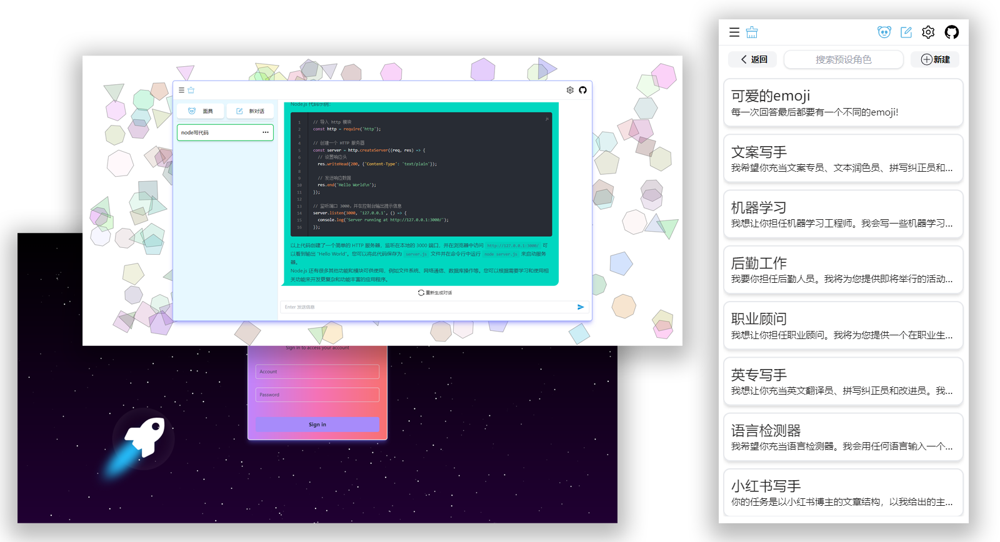

<h1 align="center">ChatGPTDemo (ChatGPT Vue Web)</h1>



# GPT

本项目使用 Vue3+Vite 完成

## 项目亮点

- Pinia+组合式 API 实现仓库数据存储;

- VueRouter 流畅的使用单页应用(前置守卫);

- 使用 TailwindCSS 完成网站整体的样式(多端适配，主题切换);

- 使用 fetch 实现流式读取网络数据;

- 每隔 10 秒自动轮询检测网页是否更新;

- 封装 SVG 组件 <use>标签可以减少 HTTP 请求;

## 主要功能

- 在 1 分钟内使用 Vercel **免费一键部署**
- 提供体积极小（~5MB）的跨平台客户端（Linux/Windows/MacOS）
- 完整的 Markdown 支持：LaTex 公式、Mermaid 流程图、代码高亮等等
- 精心设计的 UI，响应式设计，支持深色模式
- 极快的首屏加载速度（~100kb），支持流式响应
- 隐私安全，所有数据保存在用户浏览器本地
- 预制角色功能（面具），方便地创建、分享和调试你的个性化对话
- 海量的内置 prompt 列表
- 自动压缩上下文聊天记录，在节省 Token 的同时支持超长对话
- 在任何地方**无障碍**快速访问

## 项目初始化

```sh
pnpm install
```

### 项目在本地运行

```sh
pnpm dev
```

### 项目打包

```sh
pnpm build
```
